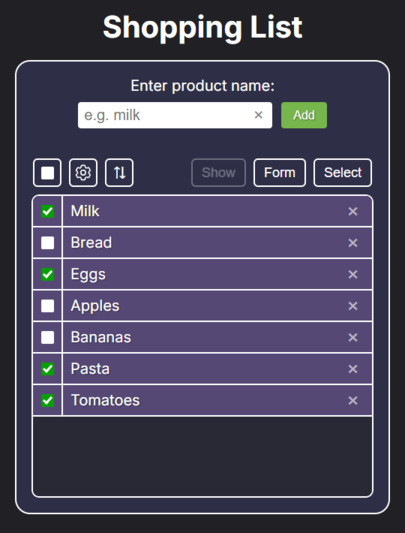
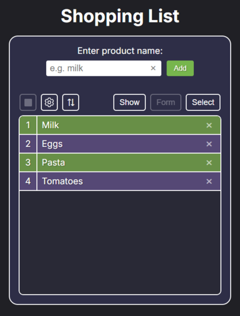

# 🛒 Shopping List

_A Web App that allows you to create and manage shopping lists with persistent storage._




## 🔍 About

**The Application Includes:**

1. _General List_ - main basket with all products (checklist functionality)
2. _Named Lists_ - customizable numbered sub-lists with:
   - Unique names
   - Color marking (green highlights)
   - Independent product management

**Key Features**:

- ✅ Persistent storage (localStorage)
- 🎨 Color-coded items
- 🔄 Sortable lists (by name/color)
- 🧩 Isolated named lists

## 🎓 Learning Purpose

This project was created to practice:

- DOM manipulation
- localStorage API
- Sass architecture

## 🛠️ Technologies

`HTML5` `Sass` `JavaScript` `Parcel`

## 🚀 How to Use It

### 1. For Users (Ready-to-Use Version)

Click the link → [Live Demo](https://klarky1.github.io/ShoppingList)

No downloads needed - the app works instantly in your browser!

### 2. For Developers

#### Prerequisites

- Node.js (v22+)
- npm

#### Installation

```bash
git clone https://github.com/klarky1/ShoppingList.git
cd ShoppingList
npm install
```

#### Development

```bash
npm start  # Starting the dev server (Parcel)
```

#### Build Production Version

```bash
npm run build  # The collected files will appear in /dist
```
